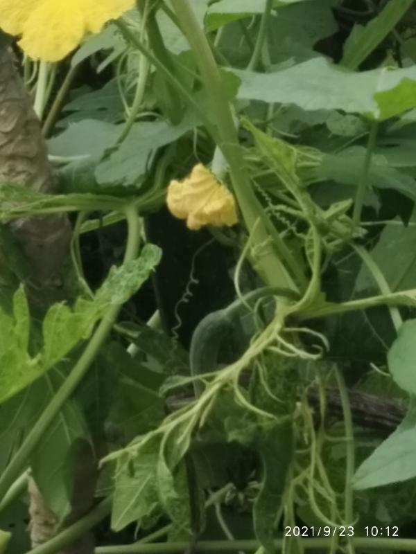
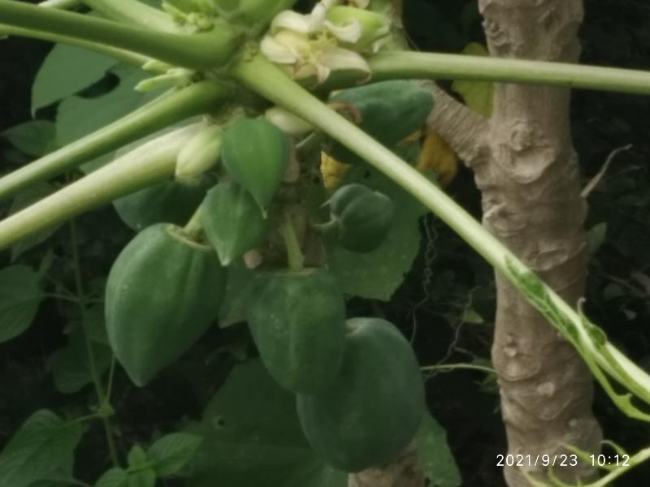
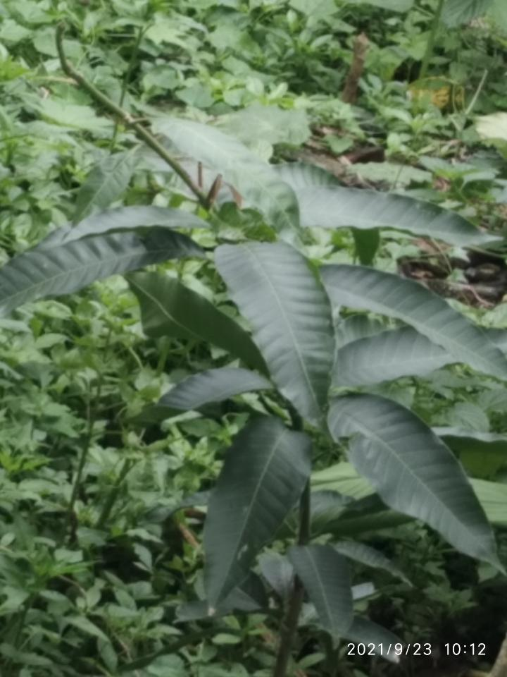
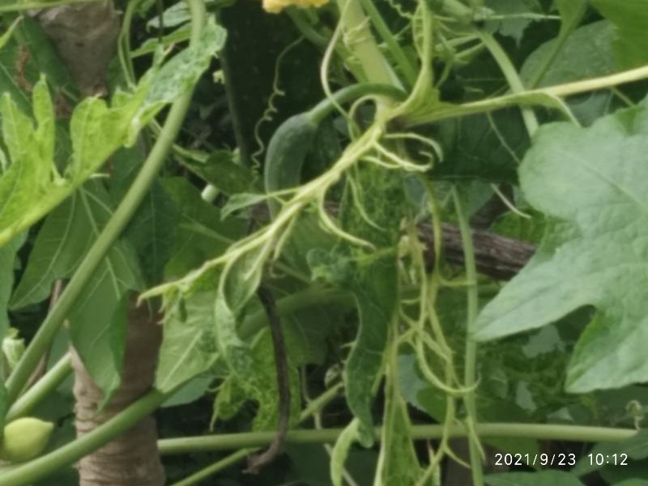

# Nehal Wild Kitchen Garden, India 

- Experiment and experience of magical nature with seed dispersal. 
- Papaya, Mango and now Ridged Gourd (tauri/turai) climber. 
- Plant/trees naturally and spontaneously growing with only seed dispersal and least/no disturbing mother nature at work. 
- Seeds thrown of fruits/ vegetables brought from market for consumption.
-  No seeds bought for sowing. 
- Also, an example that crops can grow of 'single growing season' seeds using seeds of their harvest.  
- Nature and its magic at play. Ideal enviornment gives growth to mono purpose seeds.  
- Wild plants (inedible, usually discarded ones, name unknown) also growing in sync on which climber is taking support along with Papaya trees. 
- Flowers in climber help other plants also grow properly due to pollination. Bees, butterflies, birds at work in wild ecosystem. 

Some recent photos are as follows - 

## 2021-09-23

## 2021-09-24

Freshly plucked at 12:30 PM. 

