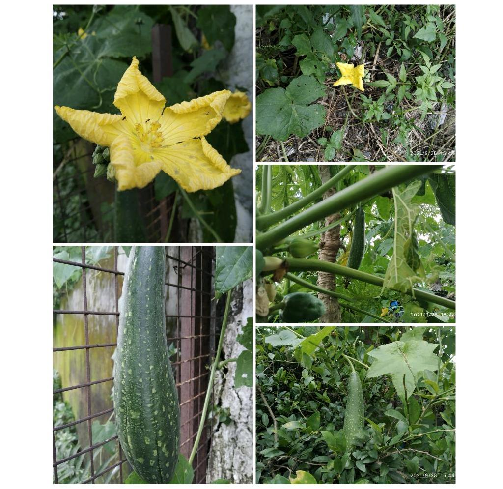
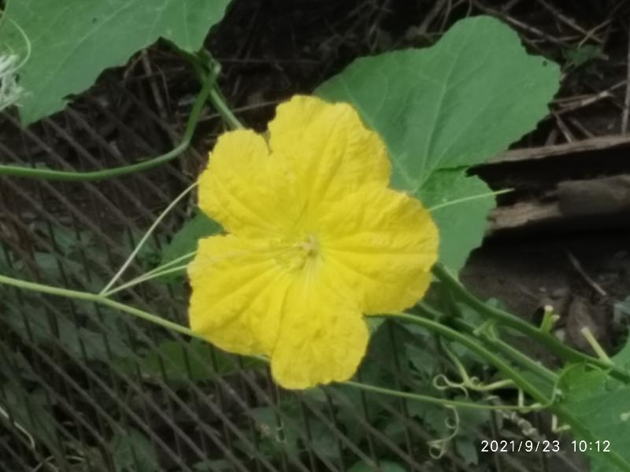
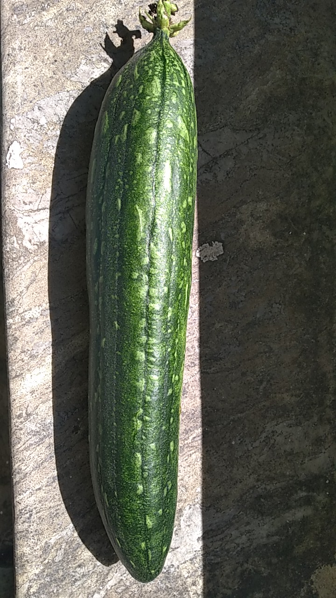
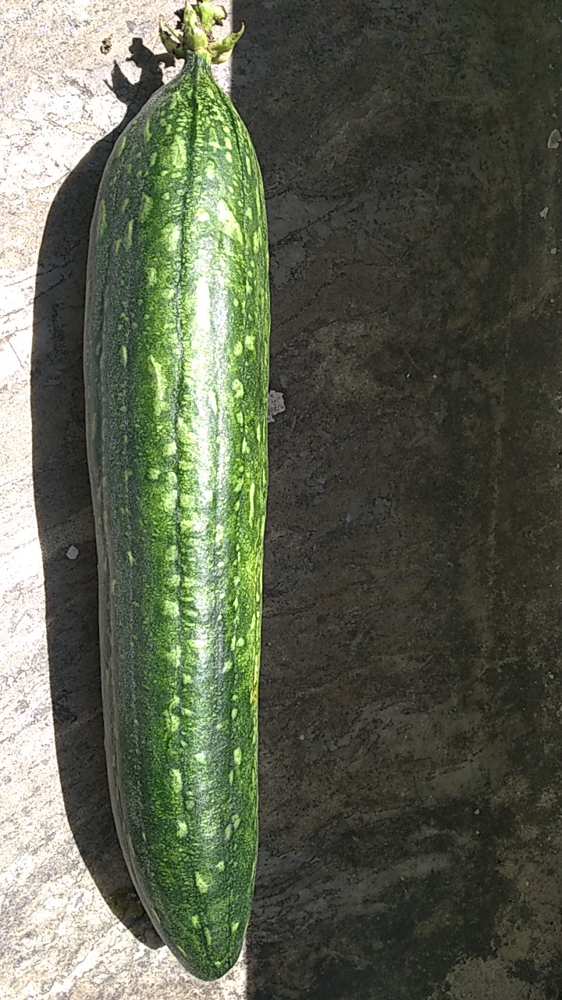
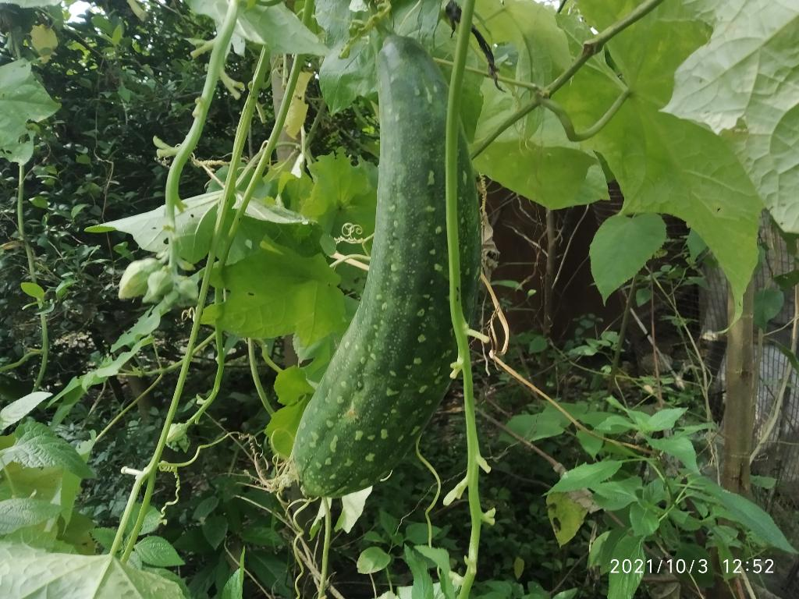

# Naisargik Kitchen Garden, Dehradun

- Experiment and experience of magical nature with seed dispersal. 
- Papaya, Mango and now Pumpkin (tauri/turai) climber. 
- Plant/trees naturally and spontaneously growing with only seed dispersal and least/no disturbing mother nature at work. 
- Seeds thrown of fruits/ vegetables brought from market for consumption.
-  No seeds bought for sowing. 
- Also, an example that crops can grow of 'single growing season' seeds using seeds of their harvest.  
- Nature and its magic at play. Ideal enviornment gives growth to mono purpose seeds.  
- Wild plants (inedible, usually discarded ones, name unknown) also growing in sync on which climber is taking support along with Papaya trees. 
- Flowers in climber help other plants also grow properly due to pollination. Bees, butterflies, birds at work in wild ecosystem. 
- Just natural garden -
    - No pesticides
    - No fertilizer
    - No pruning
    - No hybrid seeds from market

## Further details and guiding points 

### Papaya

**Time duration:** 3 years 9 months approximately

- **2018:** Several seeds dispersed. 
- General statement by all that nothing would come up from seeds of fruits of hybrid seeds. 
- Next season several seeds turned into plants. 
- A jungle of papayas. Several plants were cut so only fee could grow and fruit. Spacing. 
- Next year small fruits which were mostly eaten by birds. Less crop, inferior quality. 
- **2019:** 2-3 papayas used for making halua. 
- **2020:** Size of fruit bigger. Used for making sambhar. 
- **2021:** Size of fruit bigger than previous years. Plucked late. Curry preparation. Still flowering in September. Plants bearing fruits. Coexisting with climbers. 

### Mango 

**Time duration:** 1 year 4 months approximately

- Intense mango harvest at ancestral home first time in **2020**. 
- Good seeds. Dispersed in Nehal Wild Garden. 
- 6-7 plants came up. 
- **2021:** About 4 can be seen now from distance. 
- 2 growing properly with space for growing. 
- General statement always made that nothing will come. Mother nature's magic never fails to mesmerize. 

### Pumpkin

**Time duration:** 4-6 months approximately

- Climber bearing flowers and fruits. 
- First Pumpkin plucked on 2021-09-24. 

## Recent photos 

### 2021-09-23

### 2021-09-24

Freshly plucked at 12:30 PM. 

### 2021-10-03

